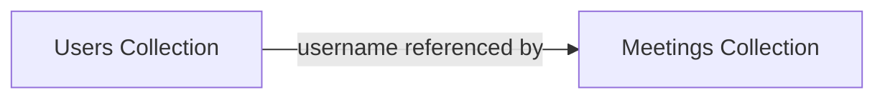
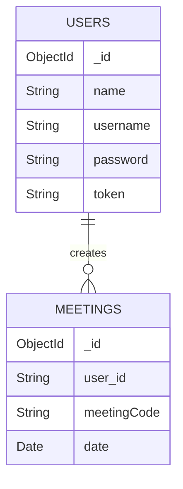

# NeoMeet – Database Structure

## Overview

NeoMeet uses **MongoDB** as its primary database and **Mongoose ODM** for schema definition and validation.

The database stores:

- User authentication data
- Meeting history records

The system currently uses **two collections**:

- `users`
- `meetings`

---

# Database Configuration

## Connection

```javascript
mongoose.connect(process.env.MONGODB_URI);


```

### Mongoose Setup

| Property | Value |
|--------|------|
| ODM | Mongoose |
| Version | 8.19.1 |
| Reconnect | Enabled |

---

# Database Collections



### Collections

| Collection | Purpose |
|-----------|--------|
| users | Store user authentication information |
| meetings | Store meeting history records |

---

# User Schema

**Location**

```
backend/src/models/user.model.js
```

### Schema

```javascript
const userSchema = new Schema({
  name: {
    type: String,
    required: true
  },
  username: {
    type: String,
    required: true,
    unique: true
  },
  password: {
    type: String,
    required: true
  },
  token: {
    type: String
  }
});
```

### Fields

| Field | Type | Required | Description |
|-----|-----|------|------|
| `_id` | ObjectId | Auto | MongoDB primary key |
| `name` | String | Yes | User display name |
| `username` | String | Yes | Unique login ID |
| `password` | String | Yes | Bcrypt hashed password |
| `token` | String | No | Authentication session token |

### Sample Document

```json
{
  "_id": "507f1f77bcf86cd799439011",
  "name": "John Doe",
  "username": "johndoe123",
  "password": "$2b$10$hashedpasswordvalue",
  "token": "randomGeneratedTokenValue"
}
```

---

# Meeting Schema

**Location**

```
backend/src/models/meeting.model.js
```

### Schema

```javascript
const meetingSchema = new Schema({
  user_id: {
    type: String
  },
  meetingCode: {
    type: String,
    required: true
  },
  date: {
    type: Date,
    default: Date.now,
    required: true
  }
});
```

### Fields

| Field | Type | Required | Description |
|-----|-----|------|------|
| `_id` | ObjectId | Auto | MongoDB generated ID |
| `user_id` | String | No | References user's username |
| `meetingCode` | String | Yes | Meeting room identifier |
| `date` | Date | Yes | Meeting timestamp |

### Sample Document

```json
{
  "_id": "507f1f77bcf86cd799439022",
  "user_id": "johndoe123",
  "meetingCode": "team-standup",
  "date": "2026-03-03T10:30:00.000Z"
}
```

---

# Entity Relationship Diagram



Relationship:

```
One User → Many Meetings
```

---

# Data Operations

## Create User

```javascript
const hashedPassword = await bcrypt.hash(password, 10);

const newUser = new User({
  name,
  username,
  password: hashedPassword
});

await newUser.save();
```

---

## Login User

```javascript
const user = await User.findOne({ username });

const isValid = await bcrypt.compare(password, user.password);

user.token = crypto.randomBytes(20).toString("hex");

await user.save();
```

---

## Find User by Token

```javascript
const user = await User.findOne({ token });
```

---

# Meeting Operations

## Create Meeting Record

```javascript
const newMeeting = new Meeting({
  user_id: user.username,
  meetingCode: meeting_code
});

await newMeeting.save();
```

---

## Get User Meeting History

```javascript
const meetings = await Meeting.find({
  user_id: user.username
});
```

---

# Query Examples

## Find User

```javascript
db.users.findOne({
  username: "johndoe123"
});
```

---

## Get User Meetings

```javascript
db.meetings.find({
  user_id: "johndoe123"
});
```

---

## Update Token

```javascript
db.users.updateOne(
  { username: "johndoe123" },
  { $set: { token: "newToken" } }
);
```

---

# Indexes

### Automatic Indexes

| Collection | Field | Type |
|
